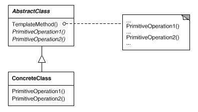

## 템플릿 (Template)

### 동기
추상 연산을 통해서 알고리즘의 일부 단계를 정의하고 서브클래스는 필요에 따라 이들 단계의 처리를 다양화시키기 위해 사용된다.

### 구조

- AbstractClass: 서브클래스들이 재정의를 통해 구현해야 하는 알고리즘 처리 단계 내의 기본 연산을 정의
- ConcreteClass: 서브클래스마다 달라진 알고리즘 처리 단계를 수행하기 위한 기본 연산을 구현


### 장점
- 알고리즘의 구조 자체는 그대로 놔둔 채 알고리즘 각 단계를 서브클래스에서 재정의할 수 있게 한다.


### 단점
- 기본 연산 수가 많아지면 알고리즘을 실체화하기 위해 필요한 재정의 연산도 많아진다.

### 예제
- 추상 클래스


- AbstractClass.java
 ```java
public abstract class AbstractClass {
    
    protected abstract void hook1();
    
    protected abstract void hook2();
    
    public void templateMethod() {
        hook1();
        hook2();
    }
    
}
```

- ConcreteClass.java
 ```java
public class ConcreteClass extends AbstractClass {

    @Override
    protected void hook1() {
        System.out.println("ABSTRACT hook1 implementation");
    }

    @Override
    protected void hook2() {
        System.out.println("ABSTRACT hook2 implementation");
    }

}
```

- TemplateMethodPatternClient.java
 ```java
public class TemplateMethodPatternClient {
    public static void main(String[] args) {
        AbstractClass abstractClass = new ConcreteClass();
        abstractClass.templateMethod();
    }
}
```

### 참고
- [템플릿 메서드 패턴이란](https://gmlwjd9405.github.io/2018/07/13/template-method-pattern.html)
- [디자인패턴 - 템플릿 메소드 패턴](https://yaboong.github.io/design-pattern/2018/09/27/template-method-pattern/)