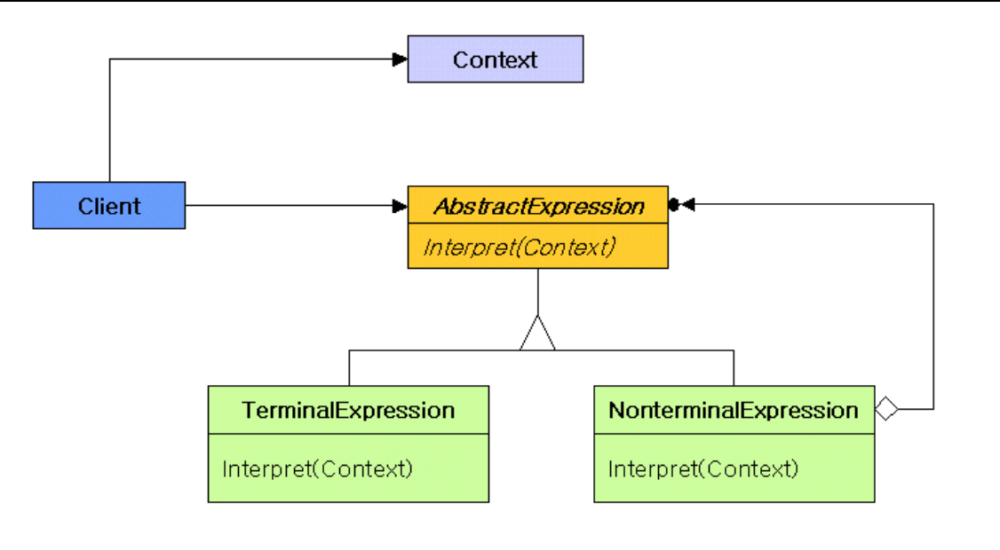

# 해석자 **(Interpreter)**

## 간단 정리

프로그램을 사용하는 사람들에게는 2가지 분류가 있다.

1. Basic User: 직관적으로 이해할 수 있는 기본적인 기능만을 사용
2. Advanced User: 보다 프로그램을 잘 사용하거나, 생산성이 높일 수 있다면 다소 번거로운 설정이나 프로그램 내부를 공부하는 것을 감수하는 사람.

Interpreter 패턴은 2번 Advanced User를 위한 패턴이다. 왜냐하면, Interpreter는 advanced user와 도메인 전문가들로 하여금 그들 자신의 생각을 표현하기 위한 `단순한 언어`(=사람이 쉽게 읽을 수 있는 간이 언어)를 제공하는 패턴이기 때문이다.

> 문법 규칙을 클래스화 한 구조로써, 일련의 규칙으로 정의된 언어를 해석하는 패턴이다. 문법 규칙이 많아지면 복잡해지고 무거워지기 때문에 그럴땐 차라리 파서/컴파일러 생성기를 쓰는게 좋다. 언어분석기 라고 생각하면 된다. 대표적인 예로는 SQL 구문이나 shell 커멘드 해석기, 통신 프로토콜 등이 있다.

보통 이때 `Domain Specific Language(DSL)`를 만들게 된다. DSL는 결제, 전투, 시각화, 설정, 통신 프로토콜 등 다양한 특수 상황에서 사용하게 된다. 

- Internal DSL: 호스트 프로그램 언어 위에서 만들어 진다. 예를 들어, 자바로 행렬을 구하는 언어를 만들어내면 internal DSL이라고 할 수 있다. 기존 언어가 있기 때문에 컴파일, 파싱 등은 신경쓰지 않아도 되지만, 호스트 언어의 한계점이 있다면 그로부터 자유롭지 못한 단점이 있다.
- External DSL: 새로운 언어를 parser, compiler부터 새로 만들어내는 것으로 어려운 작업이다.

`Interpreter는 Internal DSL와만 관계가 있다.` 

### 유의할 점:

- Interpreter는  오직 `간단한 언어`를 구현해야 한다.
- 목적은 특정 도메인의 전문가의 생산성을 높히기 위함이지, 프로그래머가 아니라는 점을 유념한다.
- 보통 DSL의 성능을 크게 중요하지 않은 경우가 많다. → 호스트 프로그램 언어의 복잡함을 감추고 보다 human-readable한 문법으로 만드는 것이 목적

### Backus-Naur Form (BNF)

간단한 문법을 정의하는데 사용된다. (파이썬 예제 참고)

    event ::= command token receiver token arguments
    
    command ::= word+
    word ::= a collection of one or more alphanumeric characters
    token ::= ->
    receiver ::= word+
    arguments :: word+

위의 BNF를 보면 기본 문법의 형태가 `command->receiver->arguments`로 되어 있는 것을 알 수 있다.

`Increase -> Boiler -> 3 도`

이를 사용해 문법으로 변환해 보자.

    word = Word(alphanums) 
    command = Group(OneOrMore(word)) 
    token = Suppress("->") 
    device = Group(OneOrMore(word)) 
    argument = Group(OneOrMore(word)) 
    event = command + token + device + Optional(token + argument) ’

---

### 구조

- AbstractExpression: 추상 구문 트리에 속한 모든 노드에 해당하는 클래스들이 공통으
로 가져야 할 Interpret() 오퍼레이션을 추상 오퍼레이션으로 정의한다.
- TerminalExpression: 문법에 정의한 터미널 기호와 관련된 해석 방법을 구현한다. 문장
을 구성하는 모든 터미널 기호에 대해서 해당 클래스를 만들어야 한다.
- NonterminalExpression: 문법의 오른편에 나타나는 모든 기호에 대해서 클래스를 정의
해야 한다.
    - 문법에 R :: = R1 R2 … Rn을 정의하고 있다면 R 에 대해서 NonterminalExpression 에 해당하는 클래스를 정의해야 한다.
    - 또한 규칙의 오른쪽에 나타난 R1 에서 Rn 에 이르기까지의 모든 기호에 대응
    하는 인스턴스 변수들을 정의해야 한다.
    - 또한 터미널 기호가 아닌 모든 기호들에 대해 서 Interpret() 오퍼레이션을 구현해야 한다. 이 Interpret() 오퍼레이션은 R1 에서 Rn에 이르기까지의 각 인스턴스 변수를 재귀적으로 호출하는 것이 일반적이다.
- Context: 번역기에 대한 포괄적인 정보를 포함한다.
- Client: 언어로 정의한 특정 문장을 나타내는 추상 구문 트리이다. 이 추상 구문 트리는 NonterminalExpression 과 TerminalExpression 클래스의 인스턴스로 구성된다. 이 인스턴스의 Interpret() 오퍼레이션을 호출한다.

### **참고**

- [http://ehpub.co.kr/17-해석자-패턴interpreter-pattern/](http://ehpub.co.kr/17-%ED%95%B4%EC%84%9D%EC%9E%90-%ED%8C%A8%ED%84%B4interpreter-pattern/)
- [https://hamait.tistory.com/199](https://hamait.tistory.com/199)
