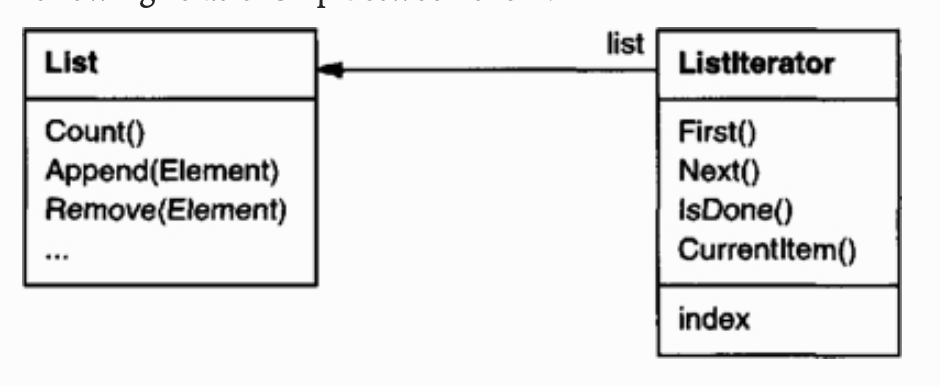

# Iterator

## 목적

내부 표현 방법을 노출하지 않고 복합 객체의 원소를 순차적으로 접근할 수 있는 방법을 제공한다

### 의도

예) 리스트가 있을 때 리스트의 인터페이스를 traversal/접근을 위한 메쏘드들로 "더럽히고 싶지 안을 때" 사용한다. 이 패턴의 중요한 점은 `접근과 순회에 대한 책임을 리스트 객체에서 제거하고, iterator 객체에 담는 것`이다.

간단한 예: ListIterator를 인스턴스화 하기 위해서는 List가 필요 → coupled!

Decoupling을 위해 *polymorphic iteration* 을 제공하도록 iterator를 일반화 할 수 있다.

### 활용

- 내부 표현 방법을 노출하지 않고 복합 객체의 원소를 순차적으로 접근하고 싶을 때
- 복합 객체의 다양한 순회 방법을 제공하고 싶을 때
- polymorphic iteration: 즉 다양한 복합체를 순회하는 하나의 인터페이스를 만들고 싶을 때

- Iterator: 요소를 접근하고 순회하는데 필요한 인터페이스 제공.
- ConcreteIterator: Iterator 에 정의된 인터페이스를 구현하는 클래스로서 순회 과정 중에 집합 객체 내의 현재 위치를 기억한다.
- Aggregate: Iterator 객체를 생성하는 인터페이스를 정의
- ConcreteAggregate: 해당하는 ConcreteIterator 의 인스턴스를 반환하도록 Iterator 생성 인터페이스를 구현한다.

### 결과

- 집합체(aggregate)를 순회하는 다양한 방법을 제공한다.
- 집합체의 인터페이스를 간단하게 한다.
- 동시에 여러 개의 순회 작업을 진행할 수 있다. (iterator가 각각 traversal state를 가지고 있기 때문)

### 기타

Wikipedia 정의

> Iterator is a design pattern in which an iterator is used to traverse a container and access the container's elements. The iterator pattern decouples algorithms from containers; in some cases, algorithms are necessarily container-specific and thus cannot be decoupled.

파이썬에는 iteration 기능이 자체 내장되어 있다. 

iterable: *Container* or *sequence* types (*list*, *tuple*, *string*, *dictionary*, *set ..)*

iterable한 객체를 순회하거나, 멤버들에 접근하기 위해서 for나 while 등을 사용할 때, 사용된다. 또한, 자체적으로 `__iter__()` 스페셜 메쏘드를 사용해서 어떠한 객체도 iterable하게 만들 수 있다. 더 이상 `next()`를 할 수 없는 경우 `StopIterationError`를 반환한다.

### 참고

- [http://sungsoo.github.io/2018/03/19/design-patterns-in-python.html](http://sungsoo.github.io/2018/03/19/design-patterns-in-python.html)
