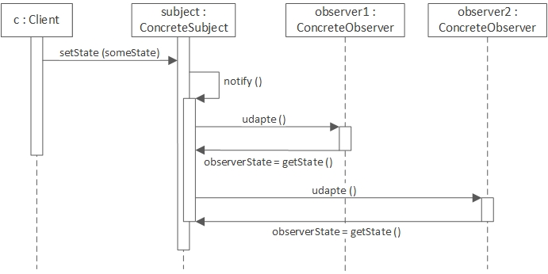

## 감시자 (Observer, Dependent, Publish-subscribe)

### 동기
1:N의 관계에서 N의 한곳에서 변경한것을 다른 곳에 즉시 알려주고싶다.


### 구조



- Subject: Observer 객체를 붙이거나 떼는 데 필요한 인터페이스를 제공한다.
- Observer: 주체에 생긴 변화에 관심 있는 객체를 갱신하는 데 필요한 인터페이스를 정의한다.
- ConcreteSubject: ConcreteObserver객체에게 알려주어야 하는 상태를 저장하고 상태가 변경될 때 감시자에게 변경을 통보한다.
- ConcreteObserver: ConcreteSubject객체에 대한 참조자를 관리한다. 주체의 상태와 일관성을 유지하도록 한다.


### 활용
- 하나의 객체가 다른 객체에게 변경 사항을 알려주어야 하는데,구체적으로 어떤 객체들에게 통보를 해야할지 모르거나 관리하고싶지 않을때


### 구현
- Subject에서 Observer 객체를 관리하는 list를 만든다.
- (optional) observer들끼리 사용하는 객체의 인터페이스를 맞춘다.
- observer에게 연락이 가는 순서에 의존하면 **절대** 안됨


### 고려사항
observer의 객체가 적고, subject객체가 여러개일때?
1) subject마다 observer list를 관리하면 **저장공간이 낭비**된다
   -  Subject 객체와 Observer 객체 간의 연관 관계를 별도의 테이블로 관리
   -  Subject객체에 의해 요청이 있을 경우에만 연관된 Observer객체의 참조값 리스트를 리턴한다
2) 하나의 연산이 여러개의 subject에 대해 데이터를 변경하면  observer는 동일한 변경에 대해 **여러번** 통보받음
   - ChangeManager: 변경데이터 일괄반영하도록 관리(SimpleChangeManager, DAGChangeManager)

subject 객체 여러 개가 동일한 observer객체에 영향을 줄 때 subject 자신과 관련된 데이터만 변경하고싶다?
- observer클래스에 정의된 update()의 인자로 subject를 전달
- 전달된 subject에서 원하는 값만 가져와서 변경된 내용을 반영한다
```java
public interface Observer {
    void update(Observable o, Object arg);
}
```
notify() 는 누가 불러야할까?
1) subject객체의 데이터 값이 변경될 때마다 notify() 자동으로 호출
   - 정보 변경이 있었을때 모든 observer에게 변경된 정보가 전달되었는지 client는 몰라도 된다. 하지만 notify()가 빈번하게 호출
2) 데이터 변경이 완료되면 client 가 직접 notify()호출
   - 데이터가 변경되고 있는 도중 불필요하게 notify()가 호출되지 않지만 client가 꼭 notify()를 불러줘야함.

subject객체가 소멸되면?
- 자신이 참조하고 있는 observer들에게 알려줌
- observer는 해당 subject로부터 참조한던 데이터를 지우거나 같이 소멸하거나..

subject객체의 notify() 멤버 함수가 불리기 전 subject 객체 내부 상태 값은 일관성을 유지해야한다 
- = observer들에게 notify를 하고 있는 도중 subject 변수가 변경되면 안됨
- `Template method` 패턴 사용
```java
public abstract class Subject {
	private int basicVar;
	public abstract void notifyObservers();

	//데이터를 변경할 때 templateMethod를 호출하여 사용한다.
	public void templateMethod(int newValue) {
		changeBasicVar(newValue);
		changeMyInstVar(newValue);
		notifyObservers();
	}

    // basicVar를 changeBasicVar/changeMyInstVar 를 통해서만 바꾸도록 하면 모든 작업이 끝난 후 notify()가 호출된다
	protected void changeBasicVar(int newValue) {
		basicVar = newValue;
	}

	protected abstract void changeMyInstVar(int newValue);
}
```

### 참고
- JAVA api Observable을 사용할 경우 Observer들을 관리하는게 vector로 되어있는데, synchronization이 문제가 되지 않는다면 ArrayList를 직접 호출하여 쓰는게 더 빠르다

  
## 관련 패턴
- `Mediator` 패턴은 서로 복잡한 관계로 얽혀 있을때 중앙 집중 형태로 묶어주고 `Observer` 패턴은 객체들간의 의존 관계를 분산 시켜준다..
- Subject는 보통 1개만 있으므로 `Singleton` 패턴 많이 사용
- `Pub-Sub` 패턴은 중간에 **Event Bus**나 **Message Broker**가 있어서 Publisher는 Broker역할을 하는곳에 메시지를 던져놓고 Subscriber도 Broker에 있는 작업만 받아 작업하면 된다.(Asynchronous)

- `Reactor` 패턴: 이벤트 핸들 패턴중의 하나로, event handeler로 이벤트를 하나씩 보내준다.(synhronous)


### 활용 예제
- java.util.observer / observable
- javax.swing의 PropertyChagneListener
```java
private static final class PropertyChangeListenerMap extends ChangeListenerMap<PropertyChangeListener> {
private static final PropertyChangeListener[] EMPTY = {};
(...)
```
- Spring Framework에서 ApplicationListener 를 구현하여 bean을 생성하면 event publisher(:subject)에 의해 ApplicationEvent(:observer)를 받을수 있게 된다
- [ReactiveX](http://reactivex.io/documentation/ko/observable.html)


### 참고
>[Pub-Sub vs Observer](https://jistol.github.io/software%20engineering/2018/04/11/observer-pubsub-pattern/) 

> [Observer Pattern in the Spring Framework](https://springframework.guru/gang-of-four-design-patterns/observer-pattern)

> [Reactor Pattern](https://ozt88.tistory.com/25)