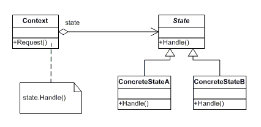

## 상태 (State)

### 동기
상태변화에 따라 행위 수행 변경도 자동으로 하기 위함

### 구조

- Context: 객체의 현재 상태를 정의한 ConcreteState 인스턴스를 유지, 관리한다.
- State:  Context의 각 상태별로 필요한 행동을 캡슐화하여 인터페이스로 정의한다.
- ConcreteState: context의 상태에 따라 처리되어야 할 실제 행동을 구현한다.

### 고려사항
1) 누가 상태 전환을 수행할까
   - Context에서 수행: context가 임의로 상태전환을 수행해 줄 수 있다
   - Concrete State 객체들끼리 서로 다음상태를 지정: 서로 참조하게되어 새로운 상태가 추가되었을때 관련된 state 무조건 수정해야함
2) 각 Concrete State의 객체는 언제 생성/삭제할까
   - 매번객체 생성: 상태 전환이 빈번하지 않거나 각 객체의 크기가 클때.
   - 모두 생성해두고 삭제하지않고 사용: 빈번한 상태전환
   - 개별 상태 정보가 공유될수 있으면 `Singleton`패턴 활용

### 장점
- 수행할 행위를 결정하기 위해 비교문을 사용하지 않아도 된다.
- 객체를 다른 객체로 변경하기 때문에 (멤버변수를 여러개 바꾸는것에 비해) 상태 정보가 일관성을 가지게 만들어 준다

### 단점
- 불필요하게 클래스가 많아질 수 있다.

### 관련 패턴
- Concrete State 내부에 데이터 멤버가 없다면(= 각 상태별로 항상 동일하다) `Flyweight` 패턴이나 `Singleton` 패턴을 활용할 수있다.

### 참고
> [Observer Pattern in the Spring Framework] https://springframework.guru/gang-of-four-design-patterns/observer-pattern/