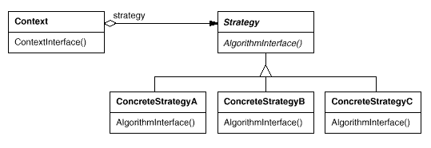

## 전략 (Strategy)

### 동기
동일 계열의 알고리즘의 서브클래싱을 피하기위해 사용된다.
동일 계열의 알고리즘을 정의하고, 각 알고리즘을 캡슐화하며, 이들을 상호 교환이 가능하도록 만든다.

### 구조

- Context: Strategy 객체에 대한 참조자를 유지 및 관리
- Strategy:  제공하는 모든 알고리즘에 대한 공통의 연산들을 인터페이스로 정의
- ConcreteStrategy: Strategy 인터페이스를 실제 알고리즘으로 구현

- Composition: Compositor 객체에 대한 참조자를 유지 및 관리
- Compositor:  제공되는 라인분리 전략의 공통연산에 대한 인터페이스
- SimpleCompositor: 한 라인씩 분리하는 전략
- TeXCompositor: 한 문단씩 분리하는 전략
- ArrayCompositor: 고정된 수의 문자를 갖도록 분리하는 전략

### 장점
- 재사용가능한 동일 계열의 관련 알고리즘군 생성
- Context와 Strategy가 분리되어 서브클래싱 없이 알고리즘을 확장하거나 변형하기 쉽다
- 조건문을 없앨 수 있다.

### 단점
- 사용자는 서로 다른 전략을 알아야한다.
- Strategy 객체와 Context 객체 사이에 의사소통 오버헤드가 있다.
- 전략들로 인해 객체 수가 증가한다.

### State와의 차이점
- State Pattern은 객체의 행위가 별도로 분리된 상태(State)에 따라 달라진다.
- Strategy Pattern은 동일 목적 알고리즘의 선택 적용 문제
- State Pattern은 상태에 따라 행위가 달라지지만, Strategy Pattern은 동일한 결과에 과정을 다르게하여 도출한다.

### 예제
- NodeJS Passport.js
- [Passport](http://www.passportjs.org/docs/)