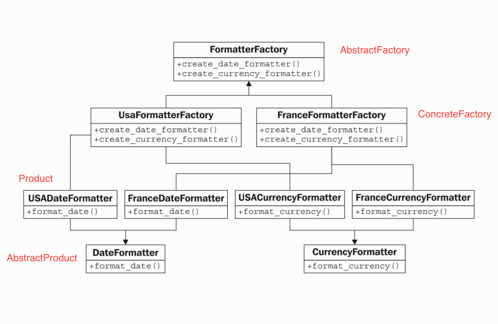
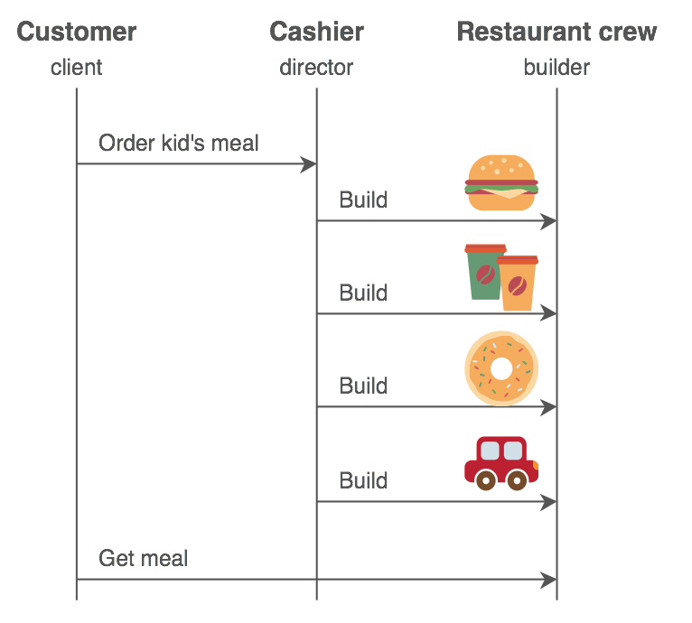

# 3장: Creational Patterns

### 정의

- 인스턴스를 만드는 절차를 추상화하는 패턴이다.
- 객체의 생성, 합성, 표현하는 방법을 시스템과 분리시킴
- 5가지 종류 설명
  - Abstract Factory
  - Builder
  - Factory Method
  - Prototype
  - Singleton


### 클래스 생성 패턴 vs 객체 생성 패턴

- 클래스 생성 패턴: 상속을 사용하여 클래스를 다양화
- 객체 생성 패턴: instantiation을 다른 객체에게 delegate(위임)한다.


### 생성패턴의 핵심

1. 시스템이 어떤 concrete(구체) 클래스를 사용하는지 캡슐화함.
2. concrete 클래스의 인스턴스들이 어떻게 생성되고 연결되어 있는지 숨김.

결론적으로, 시스템 레벨에서는 추상 클래스에서 정의된 인터페이스만 외부로 공개되어 있음.

이를 통해 `무엇을, 누가, 어떻게, 언제` 생성하는데 유연성을 제공해준다.


### The Maze Problem

예시로 미로를 생성하는 코드가 주어짐. [거의 유사한 구현체가 있는 깃헙 코드를 사용 클론](https://github.com/BartVandewoestyne/Design-Patterns-GoF) 받아서 확인함. 

Tip. vim 사용자의 경우 ctags를 사용하면 code navigation이 편리하다.

```c++
Maze* MazeGame::CreateMaze() {

    std::cout << "MazeGame::CreateMaze()" << std::endl;

    Maze* aMaze = MakeMaze();

    Room* r1 = MakeRoom(1);
    Room* r2 = MakeRoom(2);
    Door* theDoor = MakeDoor(r1, r2);

    aMaze->AddRoom(r1);
    aMaze->AddRoom(r2);

    r1->SetSide(North, MakeWall());
    r1->SetSide(East, theDoor);
    r1->SetSide(South, MakeWall());
    r1->SetSide(West, MakeWall());

    r2->SetSide(North, MakeWall());
    r2->SetSide(East, MakeWall());
    r2->SetSide(South, MakeWall());
    r2->SetSide(West, theDoor);

    return aMaze;
}
```

위 코드의 문제는 코드의 길이가 아닌 inflexibility이다. 

- Maze의 구조가 변경되면 member function 전체 또는 일부를 새로 작성해야 하기 때문.
- 생성패턴을 사용해 위 디자인을 좀 더 유연하게 구현할 수 있다. 


## Abstract Factory

### 목적 

상세화된 서브클래스(Concrete 클래스)를 정의하지 않고도 서로 관련성이 있거나 독립적인 여러 객체의 군을 생성하기 위한 인터페이스를 제공


참고:

- *The idea is to abstract the creation of objects depending on business logic, platform choice, etc.* [출처](https://github.com/faif/python-patterns/blob/master/patterns/creational/abstract_factory.py)


### 활용

**이런 상황에서 사용하는 것이 좋다.**

- 객체가 생성되거나 구성/표현되는 방식과 무관하게 시스템을 독립적으로 만들 때
- 여러 제품군 중 하나를 선택해서 시스템을 설정해야 하고 한 번 구성한 제품을 다른 것으로 대체 할 수 있을 때
- 관련된 제품 객체들이 함께 사용 되도록 설계되었고, 이 부분에 대한 제약이 외부에도 지켜지도록 하고 싶을 때
- 제품에 대한 클래스 라이브러리를 제공하고, 그들의 구현이 아닌 인터페이스를 노출 시키고 싶을 때


참고:

- *A hierarchy that encapsulates: many possible "platforms", and the construction of a suite of "products".* [출처](https://sourcemaking.com/design_patterns/abstract_factory)


### 이점 

- *Concrete 클래스를 분리한다*: client는 concrete class가 아닌, Abstract Factory와 AbstractProduct 클래스에 정의된 인터페이스만을 사용한다. 또한, product 클래스명이 클라이언트 코드에서 분리되어 있다.
- *제품군을 쉽게 대체 할 수 있다*: product family를 결정하는 concrete factory를 쉽게 바꿀수 있기 때문
- *제품 사이의 일관성을 증진 시킨다*:같은 제품군에 속한 여러 제품이 같이 사용되야하는 경우, AbstractFactory를 통해 이를 쉽게 강제할 수 있다. 


### 단점

- *새로운 종류의 제품을 제공하기가 어렵다*: AbstractFactory에 정의된 인터페이스를 따르지 않는 경우, 변경이 많아진다. 


### 설계 및 구현

- *Factories as singletons*: 런타임 동안 Product 계열별로 한 개의 ConcreteFactory만 사용된다. 따라서 구현시 보통 `singleton 패턴`(=단 하나의 인스턴스를 생성해 사용하는 디자인 패턴)을 사용하는 것이 좋다.

- *Creating the products*:  AbstractFactory는 실제 product 객체를 생성하지 않고, ConcreteFactory에게 위임한다. 이때 보통[ `factory method 패턴`](https://github.com/faif/python-patterns/blob/master/patterns/creational/factory_method.py)(=delegate a specialized function/method to create instances)을 사용하여, concrete factory가 factory method를 오버라이딩하여 product군을 정하는 방식을 사용한다.

  제품군의 종류가 여러 개인 경우, [`prototype 패턴`](https://github.com/faif/python-patterns/blob/master/patterns/creational/prototype.py)(=use a factory and clones of a prototype for new instances (if instantiation is expensive))을 사용한다. 이 방법은 새로운 제품군별로 새로운 concrete factory를 만들지 않아도 된다.

- *Defining extensible factories*: AbstractFactory의 인터페이스의 변화없이 새로운 product를 생성하는 방법으로는, 객체를 생성하는 메쏘드에 인자를 더하는 방법이 있지만(=prototype 패턴과 유사), 장단점이 있다(?).


### 샘플코드 분석

- 이 패턴을 사용하면, 다른 타입의 구성을 갖는 (room, wall등) maze를 쉽게 생성할 수 있다!
  - MazeFactory를 상속받는 EnchantedMazeFactory를 구현한 후, 멤버함수등을 오버라이딩하여 구현
  - MazeFactory는 factory method들의 집합체로 구현되어 있는데, 이는 Abstract Factory 패턴의 흔한 구현 방법이다.


### 기타(Python 3 Object-Oriented Programming 발췌)

- Abstract factory pattern의 흔한 사용예들
  - operating-system-independent toolkits: might use an abstract factory pattern that returns a set of WinForm widgets under Windows, Cocoa widgets under Mac
  - database backends: Django provides an abstract factory that returns a set of object relational classes for interacting with a specific database backend (MySQL, PostgreSQL, SQLite, and others) depending on a configuration setting for the current site
    - [django 깃헙 레포](https://github.com/django/django/)
      - django/db/base -> BaseDataBaseWrapper(AbstractFactory)
      - django/db/backends -> postgresql, oracle...(ConcreteFactory?)
      - django/db/utils -> ConnectionHandler(AbstractProduct)
        - django/db/__init__.py 에서 생성
      - django/core/management/commands/db_shell.py 등
  - country-specific formatters or calculators: Different countries have different systems for calculating taxes, subtotals, and totals on retail merchandise; an abstract factory can return a particular tax calculation object.’




### 참고

- [GoF의 디자인 패턴 - 생성패턴](https://seungdols.tistory.com/486)
- [Working code for the Design Patterns book from the Gang of Four.](https://github.com/BartVandewoestyne)
- [Python-patterns: A collection of design patterns/idioms in Python](https://github.com/faif/python-patterns)
- [Abstract Factory Design Pattern: Medium](https://medium.com/design-patterns-with-python/hihih-2ce4b45624d6?email=mhjeon%40modernlab.io&g-recaptcha-response)
- ‘Python 3 Object-Oriented Programming: Build Robust and Maintainable Software With Object-Oriented Design Patterns in Python 3.8, 3rd Edition.’ 중 "The Abstract Factory Pattern"


## Builder

### 목적 

복잡한 객체를 생성하는 방법과 표현하는 방법을 정의하는 클래스를 별도로 분리하여, 서로 다른 표현이라도 이를 생성할 수 있는 동일한 절차를 제공할 수 있도록 한다.


- 생성자 인자가 많을 때  -> 생성자 대체
- setter를 많이 사용되는 경우


### 활용

**이런 상황에서 사용하는 것이 좋다.**

- 복잡한 객체를 생성하는 알고리즘이, 객체의 요소들 및 그 관계들에 있어 독립적일 때
- 생성할 객체들의 형태(표현)가 서로 다르더라도, 생성 과정에서 이를 지원해야 할 때


- *A hierarchy that encapsulates: many possible "platforms", and the construction of a suite of "products".* [출처](https://sourcemaking.com/design_patterns/abstract_factory)


### 구성요소 및 각 구성 요소간의 관계

- Builder
- ConcreteBuilder
- Director
- Product


```python
# https://sourcemaking.com/design_patterns/builder/python/1
def main():
    concrete_builder = ConcreteBuilder()
    director = Director()
    director.construct(concrete_builder)
    product = concrete_builder.product
```


### 이점 

- *제품에 대한 내부 표현을 다양하게 변화할 수 있다*:제품 생성은 abstract interface를 통해 생성되기 때문에 제품의 표현을 변경하고 싶은 경우 새로운 빌더를 만들기만 하면 된다.
- *생성과 표현에 필요한 코드를 분리 한다*
- *복합 객체를 생성하는 절차를 좀 더 세밀하게 나눌 수 있다*: 한번에 제품을 생성하는 다른 패턴과 달리 "step-by-step"으로 생성한 후, 제품 생성이 끝난 후에만 director가 빌더로부터 제품을 가져올 수 있다.


### 구현

- *Assembly and constuction interface*: 빌더 클래스 인터페이스는 다양한 concrete builders들이 모두 가능하도록 포괄적이어야 한다.
- *Why no abstract class for products*: Concrete builder에서 생성된 products들이 너무 다르고, 또한 client에서 director를 통해 concrete builder를 사용하기 때문에, 이로부터 생성되는 product를 쉽게 알 수 있다. 
- *Empty methods as defaults in Builder*: 추상 메소드가 아닌 empty method로 구현되어, client단에서 꼭 필요한 operation만 오버라이드 할 수 있도록 구현


### 샘플코드 분석

- 빌더 패턴은 original code에 비해, Maze의 내부 구현(특히 wall)을 숨긴다 -> 보다 쉽게 Maze가 표현된 방식을 바꿀 수 있다.
- MazeBuilder를 통해 객체 생성을 캡슐화함 -> MazeBuilder를 재사용해 다양한 Maze를 만들 수 있다.
- MazeBuilder는 직접 maze를 생성하는 것이 아니라(=단순한 인터페이스 정의), 자식 클래스에서 직접 생성하는 코드를 구현함


### 관련된 다른 패턴

- Abstract Factory 
  - 공통점: 복잡한 객체를 생성하는데 사용된다
  - 차이점: 빌더 패턴은 step-by-step으로 최종 단계에서 객체가 리턴되고, abstract factory는 제품**군**에 보다 초점을 두며 바로 객체가 리턴된다.  


### 기타 



[출처](https://sourcemaking.com/design_patterns/builder)


- [Construct Your Testing Data Using the Builder Pattern](http://devblog.4teamwork.ch/blog/2013/05/24/construct-your-testing-data-using-the-builder-pattern/)
- [Useful OOP design patterns](https://dbader.org/blog/6-things-youre-missing-out-on-by-never-using-classes-in-your-python-code)
  - [schedule 라이브러리: 빌더패턴을 사용한 job scheduler](https://github.com/dbader/schedule)
    - schedule = director로 job(builder를 리턴)?
    - job = Schedule.every 메쏘드에 의해 보통 생성 및 리턴됨. (=builder?)
    - job.do = 콜되면 단계를 거쳐 생성된 job이 최종적으로 scheduler에 등록됨
  - django ORM chaining
  ```python
  Post.objects.filter(published_date__lte=timezone.now()) \
              .order_by('published_date') \
              .exclude(body_text__icontains="food")
  ```
- [Real-world examples of the Builder pattern](https://stackoverflow.com/questions/5211039/real-world-examples-of-the-builder-pattern): 자바 코드


### 참고

- [Python Design Patterns - Builder](https://www.tutorialspoint.com/python_design_patterns/python_design_patterns_builder.htm)

- [Builder in Python](https://sourcemaking.com/design_patterns/builder/python/1)

- [Design patterns and where to find them: cheatsheet 등](https://medium.com/@snk.nitin/design-patterns-and-where-to-find-them-ab57aef6f62a)


---

- 스터디 날짜: 2019.2.10
- 스터디 참석자: 권현후, 김민경, 원지운, 전승훈, 전명훈
