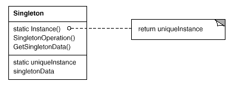
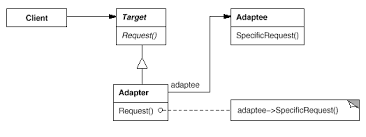

## 단일체 (SINGLETON)

### 목적
오직 **한 개**의 클래스 인스턴스만(최초 한 번만 메모리에 할당)을 갖도록 보장하고, 이에 대한 전역적인 접근을 제공함.

### 동기
하나의 인스턴스만 갖도록 하는 것이 좋은 경우가 있는데 전역 변수를 사용하지 않는 방법이 필요.
- 프린터 스풀(대기열 관리시스템)
- 다양한 리소스 pool (DB connection, Thread 등)
- Configuration, Logger 등

### 활용
- 클래스의 인스턴스가 오직 하나여야 함을 보장하고 잘 정의된 access point로 모든 사용자가 접근할 수 있도록 해야할 때
- 유일한 인스턴스가 서브클래싱으로 확장되어야 하며, 사용자는 확장된 서브클래스의 인스턴스를 사용할 수 있어야 할 때
  - 싱클톤 클래스의 서브클래스 싱클톤A, 싱클톤B의 총 인스턴스 개수를 관리.
  - [Game Unit 예제]()

### 구조
Instance()과 같은 연산을 정의하여, 유일하게 인스턴스로 접근할 수 있게 함.



### 이점
- Singleton 클래스 자체가 인스턴스를 캡슐화하여 인스턴스로의 접근을 통제함.
- 전역 변수를 사용하여 발생하는 문제점을 없앰. 
- 연산 및 표현의 정제를 허용함 (상속 가능)
- 인스턴스의 개수를 변경하기가 자유로움. (싱글톤을 더 이상 사용하고 싶지 않을 때 가능)
- 클래스 연산(static method)을 사용하는 것보다 훨씬 유연한 방법임. (서브 클래스들이 오버라이트 가능)

### 구현
1. 인스턴스가 유일해야 함을 보장: 인스턴스를 생성하는 연산을 클래스 연산으로 구현.
```java
public class MazeFactory {

    private static MazeFactory instance;
    
    private MazeFactory(){}
    
    public static MazeFactory getInstance(){
        if(instance == null){
            instance = new MazeFactory();
        }
        return instance;
    }
}
```
2. Singleton 클래스를 서브클래싱함: 서브클래스의 유일한 인스턴스를 만들어 사용자가 이를 사용할 수 있도록 하는 것. 즉, Singleton의 인스턴스를 참조하는 변수가 서브클래스의 인스턴스로 초기화 되어야 함.
```java
public static MazeFactory getInstance() {
    if(instance == null){
        String mazeStyle = System.getenv("MAZESTYLE");
        
        instance = Lookup(mazeStyle);
    }
    return instance;
}

private MazeFactory Lookup(String mazeStyle) {
    if (mazeStyle.equals("bombed")) {
        return new BombedMazeFactory;
    } else if (mazeStyle.equals("enchanted")) {
        return new EnchantedMazeFactory;
    }
}
```

### 단점
- 싱글톤 클래스가 많은 의존성을 가지게 되면 객체들 간의 결합도를 높여 수정이나 테스트가 어려워질 수 있음 
- 숨겨진 의존성을 만들고 참조가 투명하지 않아 추적하기가 힘듬

### 참고
- [Singleton Pattern Pros and Cons](https://medium.freecodecamp.org/singleton-design-pattern-pros-and-cons-e10f98e23d63)
- [Singleton in ES6](https://medium.com/@dmnsgn/singleton-pattern-in-es6-d2d021d150ae)
- [Singleton Best Practice in Java](https://www.journaldev.com/1377/java-singleton-design-pattern-best-practices-examples)
- [Singleton Lazy Initialization in Java](https://javaplant.tistory.com/21)
- [Singleton in Python](https://www.tutorialspoint.com/python_design_patterns/python_design_patterns_singleton.htm)
- [그림] GoF의 디자인 패턴

# 4장: Structural Patterns

### 정의
더 큰 구조를 형성하기 위해 어떻게 클래스와 객체를 합성하는가와 관련된 패턴.
- 구조 *클래스* 패턴: 상속을 이용해 클래스를 복합하는 방법
- 구조 *객체* 패턴: 객체를 합성하는 방법

### 종류
- 적응자 (Adapter)
- 가교 (Bridge)
- 복합체 (Composite)
- 장식자 (Decorator)
- 퍼사드 (Facade)
- 플라이급 (Flyweight)
- 프록시 (Proxy)

## 적응자 (Adapter or Wrapper)

### 목적
클래스의 인터페이스를 사용자가 기대하는 인터페이스 형대로 적응(변혼)시킴. 서로 일치하지 않는 인터페이스를 갖는 클래스들을 함께 동작시킴.

### 동기
일치 하지 않는 인터페이스를 갖는 클래스들을 잘 통합하여 사용하고 싶음.

### 활용
- 기존 클래스를 사용하고 싶은데 인터페이스가 맞지 않을 때
- 이미 만든 것을 재사용하고자 하나 이 재사용한 라이브러리를 수정할 수 없을 때
- (**객체 적응자만 해당**) 이미 존재하는 여러 개의 서브클래스를 사용해야 하는데, 이 서브클래스들의 상속을 통해서 이들의 인터페이스를 다 개조하는 것이 현실 성이 없을 떄

### 구조
##### 클래스 적응자


##### 객체 적응자


### 이점
##### 클래스 적응자
- Adaptee에 정의된 행동을 제정의할 수 있음.
- 1개의 객체(Adapter)만 사용하며, Adaptee로 가기 위한 추가적인 포인터 간접화가 필요하지 않음.

##### 객체 적응자
- Apater 클래스는 하나만 존재해도 수 많은 Adaptee 클래스들과 동작 가능.

### 단점
##### 클래스 적응자
- 하나의 클래스와 이 클래스의 모든 서브 클래스들을 개조할 때 사용 불가(Adaptee의 서브클래스를을 상속 받는 것이 아니므로, 서브클래스들에 정의된 기능들을 사용 불가)

##### 객체 적응자
- Adaptee 클래스의 행동을 재정의하기가 매우 어려움.

### 고려할 사항
##### 대체 가능 적응자 (pluggable adapter)
클래스의 재사용성을 높이려면, 누가 이 클래스를 사용할지에 대한 생각을 최소화할 것.
- 다른 인터페이스를 원하는 사용자가 있다면, 인터페이스 개조를 담당하는 대체 가능 적응자 사용.

##### 양방향 적응자 (two-way adapter)
적응자가 모든 사용자에게 투명하지 않음. 적응된 객체는 Target의 인터페이스를 만족함. Adaptee를 통해 Target을 사용해야 하는 사용자는 적응된 객체를 사용할 수 없음.
- 다중 상속을 이용한 양방향 적응자 사용.

### 구현
##### 대체 가능 적응자
a. 추상 연산 사용
b. 위임 객체 사용
c. 매개변수화된 적응자를 사용

### 참조
 - [Adapter Pattern  - Java](https://blog.seotory.com/post/2017/09/java-adapter-pattern)
 - [Adpater Pattern (Class - Java)](https://niceman.tistory.com/141)
 - [그림] GoF의 디자인 패턴

---

- 스터디 날짜: 2019.2.24
- 스터디 참석자: 권현후, 김민경, 전승훈, 전명훈, 차민철
