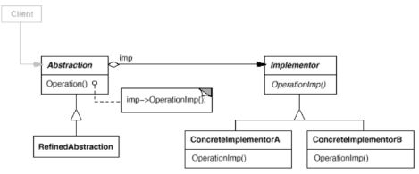
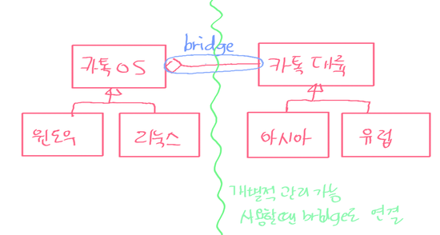
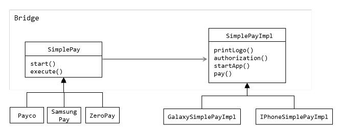

## 가교 (Bridge)

### 목적
**구현에서 추상을 분리**하여, 이들이 독립적으로 다양성을 가질 수 있도록 한다.

### 동기
하나의 추상적 개념이 여러 가지 구현으로 구체화 될 수 있을때 단순 상속으로 구현하면 클래스가 엄청많이 늘어나고 추상클래스가 구체클래스에 종속적이게된다.

### 구조
Abstraction 클래스가 사용자 요청을 Implementor 객체에 전달



### 활용
- 추상적 개념과 이에 대한 구현 사이의 지속적인 종속 관계를 피하고 싶을때 (런타임에 구현방법을 선택)
- 추상적 개념과 구현 모두가 독립적으로/다른형태로 서브클래싱을 통해 확장되어야 할때
- 구현클래스 내용을 변경하는 것이 다른 관련 프로그램에 영향을 주지 않아야할때
- 중첩된 일반화: 클래스 계통에서 클래스 수가 급증하는것을 방지하고자 할 때
- 여러 객체들에 걸쳐 구현을 공유하고자 하며, 이런사실을 Client 쪽애 공개하고 싶지 않을때
  
	- ex1) 아래 경우와 비슷하게 library 구축에 많이 사용된다
  
	- ex2)
	


### 구현
한 한드폰에 1개의 SimplePay만 들어간다고 합시다^.^

[Bridge Example - simplepay](https://github.com/betterdevstomorrow/design-patterns/tree/master/Structural_Patterns/bridge-example)




```java
//호출
public void test() {
	List<SimplePay> windows = new ArrayList<SimplePay>();
	windows.add(new SamsungPay().setImpl(SimplePay.TYPE_GALAXY));
	windows.add(new SamsungPay().setImpl(SimplePay.TYPE_IPHONE));

	windows.stream().forEach(w -> {
		w.start();
		w.execute();
	});
}
```


1. 추상적 개념인 SimplePay는 구현클래스인 SimplePayImple을 호출한다.
```java
public abstract class SimplePay {
	public static final String TYPE_IPHONE = "iPhone", TYPE_GALAXY = "galaxy";

	private SimplePayImpl impl;

	public SimplePayImpl getSimplePayImpl() {
		return impl;
	}

	public SimplePay setImpl(String type) {
		if (TYPE_IPHONE.equals(type)) {
			impl = new IPhoneSimplePayImpl();
		} else if (TYPE_GALAXY.equals(type)) {
			impl = new GalaxySimplePayImpl();
		}
		return this;
	}

	public void start() {
		impl.printLogo();
	}

	public abstract void execute();
}
```

2. SimplePay를 상속받은 Payco, SamsungPay, ZeroPay를 구현한다. 
```java
public class Payco extends SimplePay {

	@Override
	public void execute() {
		SimplePayImpl imp = getSimplePayImpl();
		if (imp != null) {
			imp.startApp("PAYCO");
			imp.authorize();
			imp.pay(1000);
		}
	}
}

public class ZeroPay extends SimplePay {
	String accountID = "1234567";

	@Override
	public void execute() {
		SimplePayImpl imp = getSimplePayImpl();
		if (imp != null) {
			imp.startApp("ZERO PAY");
			imp.enterAccount(accountID);
			imp.pay(1000);
		}
	}
}
```

3.  SimplePayImpl은 SimplePay에 정의된 인터페이스에 정확하게 대응할필요는 없다
```java
public interface SimplePayImpl {
	public void printLogo();
	public void startApp(String appNm);
	public void authorize();
	public void pay(int price);
	public void payNFC(int price);
	public void enterAccount(String id);
}
```
4. SimplePayImpl을 상속받은 실제 구현내용
```java
public class GalaxySimplePayImpl implements SimplePayImpl {

	@Override
	public void printLogo() {
		System.out.println("=== Samsung ===");
	}

	@Override
	public void pay(int price) {
		System.out.println("pay " + price + " won.");
	}

	@Override
	public void startApp(String appNm) {
		System.out.println("Start android [" + appNm + "] Application");
    }
    
    //....
}

public class IPhoneSimplePayImpl implements SimplePayImpl {
	@Override
	public void printLogo() {
		System.out.println("=== iPhone ===");
	}

	@Override
	public void payNFC(int price) {
		System.out.println("dose not support NFC system.");
	}

	@Override
	public void startApp(String appNm) {
		System.out.println("Start apple [" + appNm + "] Application");
    }

    //...
}
```


### 이점
- 인터페이스와 구현 분리: layering이 가능해 상위수준에서는 Abstraction, Implementor만 알면 된다.
- 구현 세부사항을 사용자에게서 은닉할수있다

### 단점
디자인이 복잡해진다

### Bridge vs Adapter pattern
- Adapter패턴은 서로 관계가 없었던 클래스들을 **어느순간 필요에 의해** 서로 엮어주기 위해 사용하는것이고, Bridge패턴은 **애초에** 인터페이스와 구현을 서로 독립적으로 나누어 설계하기 위해 사용한다.
- 목적
  - Adapter: 이미 존재하고 있는 객체를 이용해서 다른 객체의 인터페이스를 만들어준다
  - Bridge: 인터페이스와 구현을 분리
- 설계
  - Adapter: 이미 존재하는 클래스를 어떻게 활용할것인가  
  - Bridge: 인터페이스와 구현이 서로 독립적으로 변경될수있게 처음부터 고려함
- 구현
  - Adapter: 구현클래스의 객체를 데이터 멤버로 반드시 가지고 있을 필요가 없다
  - Bridge: 항상 구현 클래스의 객체가 있어야 하고 이를 통해서만 구현이 이루어질 수 있다

### 참고
- [Bridge Pattern Example1 - shape and draw api](https://www.tutorialspoint.com/design_pattern/factory_pattern.htm)
- [Bridge Pattern Example2 - os and continent](https://blog.naver.com/drifterz303/90194293283)
- [Bridge Pattern Example3(python) A/B test ] https://www.giacomodebidda.com/bridge-pattern-in-python/

---

- 스터디 날짜: 2019.3.4
- 스터디 참석자: 권현후, 김민경, 원지운, 전승훈, 전명훈, 차민철
