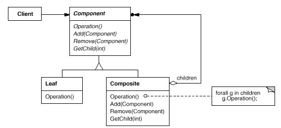
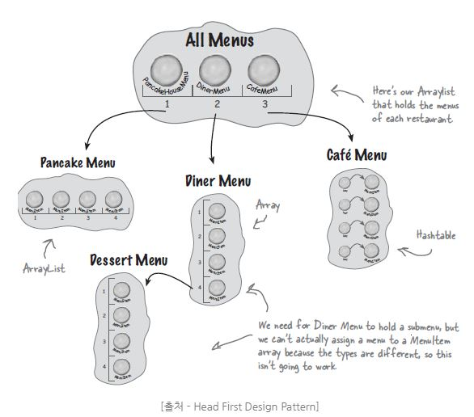

## 복합체 (Composite)

### 목적
개별 객체와 복합 객체를 모두 동일하게 다룰 수 있도록 한다

### 동기
개별 객체와 복합객체를 구분하기 위해 개발자가 분기처리를 해야한다.


### 구조
Client는 Component 클래스 인터페이스를 사용.
대상이 Leaf 인스턴스이면 자신이 정의한 행동을 직접 수행하고
대상이 Composite이면 자식객체들에게 위임한다.



### 활용
- 부분-전체의 객체 계통을 표현하고 싶을때
- 사용자가 객체의 합성으로 생긴 복합 객체(Composite)와 개개의 객체(Leaf) 사이의 차이를 알지 않고도 자기 일을 할 수 있도록 만들고 싶을때
	- ex) file system (folder: composite / file: leaf)
	- ex2) [jquery](https://subscription.packtpub.com/book/web_development/9781785888687/1/ch01lvl1sec09/the-composite-pattern)



### 구현
- 자식사이의 순서가 있을 경우 자식에게 접근, 관리하는 인터페이스를 설계할때 주의해야함!
- leaf클래스에게 add나 remove 호출하지 않도록 해야함

[Composite Example - equipment](https://github.com/betterdevstomorrow/design-patterns/tree/master/Structural_Patterns/composite-example/equipment)

0. 호출 (component, composite equipment의 구분없이 price()호출)
 ```java
@Test
public void test() {
    Cabinet cabinet = new Cabinet("PC Cabinet");
    Chassis chassis = new Chassis("PC Chassis");

    cabinet.add(chassis);

    Bus bus = new Bus("MCA Bus");
    bus.add(new Card("16Mbs Token Ring"));
    chassis.add(bus);
    chassis.add(new FloppyDisk("3.5bin Floppy"));

    System.out.println("The new price is " + chassis.price() + " won.");
}
```


- Equipment를 상속받아 Composite Equipment를 구현
   - CompositeEquipment에서 createIterator로 iterator를 받아서 사용하여 각 composite마다 다른 데이터구조를 사용할 수 있다

```java
public abstract class Equipment {
    private String name;
}
```
   
```java
public class CompositeEquipment extends Equipment {
        //... 

	@Override
	public int price() {
		Iterator<Equipment> list = createIterator();
		int total = 0;
		while (list.hasNext()) {
			total += list.next().price();
		}
		list = null;
		return total;
	}
```

- compositeEquipment는 각기 다른 데이터 구조를 사용하여 component 저장 가능
```java
public class Bus extends CompositeEquipment {
    private TreeSet<Equipment> list;
    //...
}

public class Cabinet extends CompositeEquipment {
    private ArrayList<Equipment> list;
    //...
}

public class Chassis extends CompositeEquipment {
    private LinkedList<Equipment> list;
    //...
}
```

### 이점
- 사용자 코드가 단순해진다
- 새로운 종류의 Component를 쉽게 추가할수있다. 기존의 코드에 영향을 주지 않는다.

### 단점
- 설계가 지나치게 범용적이라 Component에 제약을 가하기 힘들다. 

### 참고
- [Composite Pattern Example1 - menu](
https://blog.naver.com/klp0712/220855121178)


---

- 스터디 날짜: 2019.3.4
- 스터디 참석자: 권현후, 김민경, 원지운, 전승훈, 전명훈, 차민철
