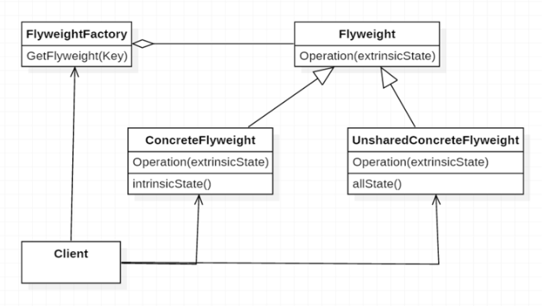

## 플라이급 (Flyweight)

### 목적

공유할 수 있는 객체를 **공유 풀에 형성**하여 메모리를 절약한다.

### 동기

수 많은 객체를 생성하고 사용하는 환경에서는 엄청난 양의 메모리와 실행 시간이 야기된다. 이를 해결하기 위해 공통적으로 사용하는 객체를 공유 풀에 담고, 이를 참조하는 형태로 사용한다.

### 구조



| Class                     | 설명                                                                                                                    |
| ------------------------- | ----------------------------------------------------------------------------------------------------------------------- |
| Flyweight                 | Flyweight가 받아들일 수 있고 부가적 상태에서 동작하는 인터페이스를 선언.                                                |
| ConcreteFlyweight         | Flyweight 인터페이스를 구현하고 내부적으로 갖고 있어야 하는 상태에 대한 저장소를 정의.                                  |
| UnsharedConcreteFlyweight | Flyweight는 공유 가능하긴 하지만, 그것을 강요해서는 안된다. 그렇기에 공유되지 않는 객체를 포함한 모든 Flyweight를 정의. |
| FlyweightFactory          | Flyweight 객체를 생성하고 관리 및 제대로 공유되도록 보장.                                                               |
| Client                    | Flyweight 객체에 대한 참조자를 관리, Flyweight의 부가적 상태를 저장.                                                    |

### 활용

- 응용프로그램이 대량의 객체를 사용해야 할 때
- 객체의 수가 너무 많아져 저장 비용이 너무 높아질 때
- 대부분의 객체 상태를 부가적인 것으로 만들 수 있을 때
- 부가적인 속성들을 제거한 후 객체들을 조사해 보니 객체의 많은 묶음이 비교적 적은 수의 공유된 객체로 대체될 수 있을 때
- 응용프로그램이 객체의 정체성에 의존하지 않을 때.(객체가 식별자를 필요로 하지 않을 때)

### 구현

#### 고려사항

- **부가적 상태를 제외한다.** 부가적인 상태 정보를 제거하면 객체의 저장소 공간을 절약
- **공유할 객체를 관리한다.** 사용자는 직접 인스턴스를 생성하지 않고, FlyweightFactory를 통해 Flyweight를 생성 및 관리

```javascript
class Flyweight {
  constructor(make, model, processor) {
    this.make = make;
    this.model = model;
    this.processor = processor;
  }
}
```

```javascript
const FlyweightFactory = {
  flyweights: {},
  get(make, model, processor) {
    const key = `${make} ${model}`;
    if (!FlyweightFactory.flyweights[key]) {
      FlyweightFactory.flyweights[key] = new Flyweight(make, model, processor);
    }
    return FlyweightFactory.flyweights[key];
  },
  getCount() {
    return Object.keys(FlyweightFactory.flyweights).length;
  },
};
```

```javascript
class ComputerCollection {
  constructor() {
    this.computers = {};
    this.count = 0;
  }

  add(make, model, processor, memory, tag) {
    this.computers[tag] = new Computer(make, model, processor, memory, tag);
    this.count += 1;
  }

  get(tag) {
    return this.computers[tag];
  }

  getCount() {
    return this.count;
  }
}
```

```javascript
class Computer {
  constructor(make, model, processor, memory, tag) {
    this.flyweight = FlyweightFactory.get(make, model, processor);
    this.memory = memory;
    this.tag = tag;
    this.getMake = () => this.flyweight.make;
  }
}
```

### 이점

- 재사용되는 객체의 공간을 절약할 수 있다.
- 일반 상태와 부가 상태를 함께 혼용하여 사용할 수 있다.

### 단점

- 객체의 인스턴스 개수는 많지 않거나, 각각의 인스턴스의 변화가 클 때 이점이 반감된다.

### 참고

https://www.dofactory.com/javascript/flyweight-design-pattern

https://dzone.com/articles/design-patterns-in-the-real-world-flyweight

—

- 스터디 날짜: 2019.3.16
- 스터디 참석자: 권현후, 김민경, 원지운, 전승훈, 전명훈, 차민철
