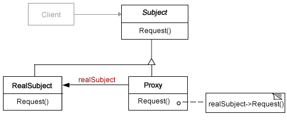

## 프록시 (Proxy)

### 목적

다른 객체에 대한 접근을 제어하기 위한 **대리자** 객체를 둔다.

### 동기

생성이나 관리가 어려운 객체를 꼭 필요할 때만 생성하고 사용할 수 있도록 해야한다. 그리고 이 사실을 Client에게 숨겨 프로그램의 구현을 복잡하지 않게 할 필요가 있다.

### 구조



### 활용

다방면에 활용할 수 있거나, 정교한 객체 참조자가 필요할 때 활용

| Proxy 종류                       | 설명                                              |
| -------------------------------- | ------------------------------------------------- |
| 원격지 프록시 (remote proxy)     | 서로 다른 주소 공간에 존재하는 객체를 가리킴      |
| 가상 프록시 (virtual proxy)      | 요청이 있을 때만 필요한 고비용 객체를 생성        |
| 보호용 프록시 (protection proxy) | 원래 객체에 대한 실제 접근을 제어                 |
| 스마트 참조자 (smart reference)  | 실제 객체에 접근이 일어날 때 추가적인 행동을 수행 |

### 구현

```javascript
// Subject
class Image {
  display() {}
}
```

```javascript
// RealSubject
class RealImage extends Image {
  constructor(fileName) {
    super();
    this.fileName = fileName;
    this.loadFromDisk(fileName);
  }

  display() {
    console.log(`Displaying ${this.fileName}`);
  }

  loadFromDisk(fileName) {
    console.log(`Loading ${fileName}`);
  }
}
```

```javascript
// Proxy(Virtual Proxy)
class ProxyImage extends Image {
  constructor(fileName) {
    super();
    this.fileName = fileName;
  }

  display() {
    if (!this.realImage) {
      this.realImage = new RealImage(this.fileName);
    }
    this.realImage.display();
  }
}
```

### 이점

- 상대하는 객체와 동일한 인터페이스를 제공하기 때문에, 사용자는 원래 객체와 구분하지 않고 사용할 수 있다.
- 객체를 감싸 수행하기 때문에 원본을 수정하지 않아도 된다.

### 관련 패턴

- 적응자 vs 프록시
  - 적응자 : 정의된 원래 인터페이스와 다른 인터페이스를 제공한다.
  - 프록시 : 원래 인터페이스와 동일한 인터페이스를 제공.
- 장식자 vs 프록시
  - 장식자와 프록시의 구현 방법은 비슷
  - 장식자의 목적 : 하나 이상의 서비스를 추가하기 위함
  - 프록시의 목적 : 객체에 대한 접근을 제어

### 참고

https://www.tutorialspoint.com/design_pattern/proxy_pattern.htm

http://hacks.mozilla.or.kr/2016/03/es6-in-depth-proxies-and-reflect/

https://stackoverflow.com/questions/3489131/difference-between-the-facade-proxy-adapter-and-decorator-design-patterns

https://micropyramid.com/blog/overriding-django-model-behaviour-with-proxy-model/

—

- 스터디 날짜: 2019.3.16
- 스터디 참석자: 권현후, 김민경, 원지운, 전승훈, 전명훈, 차민철
